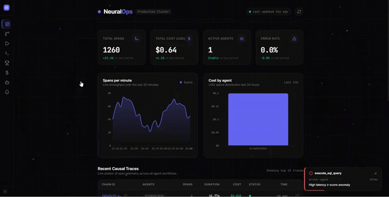

<div align="center">

<a href="https://neuralops.pages.dev">

</a>
&nbsp;

&nbsp;

&nbsp;

&nbsp;

&nbsp;

<br/><br/>

```
 ███╗   ██╗███████╗██╗   ██╗██████╗  █████╗ ██╗      ██████╗ ██████╗███████╗
 ████╗  ██║██╔════╝██║   ██║██╔══██╗██╔══██╗██║     ██╔═══██╗██╔══██╗██╔════╝
 ██╔██╗ ██║█████╗  ██║   ██║██████╔╝███████║██║     ██║   ██║██████╔╝███████╗
 ██║╚██╗██║██╔══╝  ██║   ██║██╔══██╗██╔══██║██║     ██║   ██║██╔═══╝ ╚════██║
 ██║ ╚████║███████╗╚██████╔╝██║  ██║██║  ██║███████╗╚██████╔╝██║     ███████║
 ╚═╝  ╚═══╝╚══════╝ ╚═════╝ ╚═╝  ╚═╝╚═╝  ╚═╝╚══════╝ ╚═════╝ ╚═╝    ╚══════╝
```

**Production-Grade AI Agent Observability Platform**

Real-time tracing · Causal decision replay · Root cause attribution · Cost forecasting · Time-travel debugging · Multi-LLM benchmarking. Self-hosted. Open source. Zero vendor lock-in.

<br/>

[**Live Demo**](https://neuralops.pages.dev) &nbsp;|&nbsp; [**Quickstart**](#quickstart) &nbsp;|&nbsp; [**Architecture**](#architecture) &nbsp;|&nbsp; [**SDK**](#sdk) &nbsp;|&nbsp; [**Dashboard**](#dashboard) &nbsp;|&nbsp; [**Novel Algorithms**](#novel-algorithms)

</div>
<br/>



---

## The problem

You deploy an AI agent to production. It starts returning wrong answers. You open your logs and see:

```
INFO  agent_step completed in 2.3s
INFO  agent_step completed in 8.1s
ERROR agent_step failed: timeout
```

That is all you get. No prompt. No model response. No tool call sequence. No cost breakdown. No way to know which step in a 12-hop reasoning chain went wrong or why. No way to replay the decision. No way to compare this run against a passing one.

Every existing observability tool stops at tokens and latency. They tell you *something* failed. They cannot tell you *why the agent made that decision* or *what would have happened if it hadn't*.

NeuralOps closes that gap.

---

## What NeuralOps does differently

| Capability | Datadog | Langfuse | **NeuralOps** |
|---|---|---|---|
| Span tracing | Yes | Yes | **Yes** |
| Token cost attribution | Yes | Yes | **Yes** |
| Causal chain across agent hops | No | No | **Yes** |
| Decision replay | No | Partial | **Yes** |
| Real-time drift detection | Yes | No | **Yes** |
| Semantic search over traces | No | No | **Yes** |
| LLM-as-judge eval | No | Yes | **Yes** |
| Multi-LLM benchmark arena | No | No | **Yes** |
| Root cause attribution scoring | No | No | **Yes** |
| Trace diff (git diff for agents) | No | No | **Yes** |
| Agent fingerprinting + clustering | No | No | **Yes** |
| Agent genealogy force graph | No | No | **Yes** |
| Time-travel counterfactual debugger | No | No | **Yes** |
| Prompt mutation lab (5 auto-variants) | No | No | **Yes** |
| 24h cost forecasting w/ CI bands | Partial | No | **Yes** |
| Hallucination risk prediction | No | Partial | **Yes** |
| Auto-firing Slack/PagerDuty alerts | Yes | No | **Yes** |
| LangGraph / AutoGen / CrewAI auto-instr. | No | Partial | **Yes** |
| gRPC ingestion endpoint | No | No | **Yes** |
| OpenTelemetry collector config | Yes | No | **Yes** |
| Self-hosted, open source | No | Yes | **Yes** |
| Built-in free LLM router | No | No | **Yes** |
| Live span feed (WebSocket/polling) | No | No | **Yes** |
| GitHub Actions cron data seeder | No | No | **Yes** |
| 1000 spans/sec load-tested | No | No | **Yes** |

The core innovation is the `causal_chain_id` — a UUID that travels across every agent hop, tool call, and service boundary. When Agent A delegates to Agent B which calls a tool which hits an LLM, every span shares one chain ID. The full decision tree is queryable in a single Postgres scan with pgvector semantic similarity.

---

## Architecture

```
Agents (LangGraph / CrewAI / AutoGen / LangChain / custom)
         |
         | NeuralOps SDK  (pip install neuralops-observability)
         |
    +----+----+
    |         |
    v         v
HTTP REST    gRPC (port 50051)
    |         |
    v         v
 +------------------+
 |  FastAPI /ingest |  validates, enriches, batches spans
 +------------------+
         |
         v
 +------------------+
 | Redis Streams    |  async span queue, at-least-once delivery
 | (Upstash)        |  consumer group, XACK on flush
 +------------------+
         |
         v
 +------------------+
 | Background       |  batch consumer, Welford drift detection,
 | Consumer         |  pgvector embedding indexing, WS broadcast
 +------------------+
         |
    +----+----+
    v         v
+----------+  +--------------+
|  Neon    |  | pgvector     |
| Postgres |  | 384-dim      |
| 26-col   |  | IVFFlat idx  |
| spans    |  | cosine sim   |
+----------+  +--------------+
    |
    v
+----------------------------------+     +------------------+
|   Next.js 14 Dashboard           | --> | Alert Watchdog   |
|   neuralops.pages.dev            |     | 60s loop         |
|                                  |     | Slack/PagerDuty  |
|  /             Overview          |     +------------------+
|  /traces       Trace Explorer    |
|  /replay/:id   Causal Replay     |     +------------------+
|  /diff         Trace Diff        |     | Cost Forecast    |
|  /fingerprints Agent Profiles    |     | Exp. Smoothing   |
|  /genealogy    Force Graph       |     | 90% CI bands     |
|  /lab          Prompt Lab        |     +------------------+
|  /time-travel  Counterfactual    |
|  /search       Semantic Search   |     +------------------+
|  /anomalies    Drift Replay      |     | GitHub Actions   |
|  /cost         Cost + Forecast   |     | Cron seeder 6h   |
|  /agents       Agent Registry    |     +------------------+
|  /arena        Benchmark Arena   |
|  /playground   Live Pipeline     |
|  /alerts-config Webhook Config   |
+----------------------------------+
         |
         v
+------------------+     +------------------+
| Prometheus       |     | OTel Collector   |
| /metrics (live)  |     | OTLP gRPC/HTTP   |
| Alert rules      |     | drop-in pipeline |
+------------------+     +------------------+
```

**Stack:**

```
Python SDK        OpenTelemetry instrumentation, async batching exporter, Welford drift
FastAPI           Ingestion API (REST + gRPC), agent routes, WebSocket live feed
Redis Streams     Span queue, at-least-once delivery, consumer group (Upstash free tier)
Neon Postgres     Columnar trace store, pgvector semantic search, sub-second queries
pgvector          384-dim embeddings per span, cosine similarity search, IVFFlat index
Prometheus        Real-time metrics (spans/min, error rate, latency, cost), alert rules
OTel Collector    OTLP gRPC/HTTP receiver, NeuralOps exporter, host metrics
Next.js 14        Dashboard, App Router, TypeScript, Framer Motion, Recharts
Docker Compose    Full local stack: API + Redis + Prometheus + Grafana + OTel Collector
GitHub Actions    Benchmark CI + cron data seeder every 6 hours
Cloudflare Pages  Global CDN deployment, auto-deploys on git push
Render            Free-tier API hosting, kept alive via UptimeRobot
```

---

## Quickstart

**Prerequisites:** Docker, Python 3.10+

```bash
# 1. Clone
git clone https://github.com/Aprameya05/neuralops
cd neuralops

# 2. Add your free API keys (no credit card needed)
cp .env.example .env
# Edit .env: GROQ_API_KEY, MISTRAL_API_KEY, OPENROUTER_API_KEY

# 3. Start the full local stack
docker compose up -d

# 4. Install SDK and run the data seeder
pip install neuralops-observability
python scripts/seed_production_data.py

# 5. Open dashboard
# Live: https://neuralops.pages.dev
# Local: cd dashboard && npm install && npm run dev → http://localhost:3000
```

---

## SDK

Drop-in instrumentation for any agent framework. Three lines to start, zero changes to business logic.

### Initialize

```python
import neuralops

ctx = neuralops.init(
    endpoint="https://neuralops-api-cmgf.onrender.com",
    service="planner-service",
    agent_id="planner-v2",
    framework="langgraph",
)
```

### Trace any function

```python
@neuralops.trace("retrieve_context")
async def retrieve(query: str) -> list[str]:
    return results  # your code unchanged
```

### Trace LLM calls with automatic cost attribution

```python
async with neuralops.trace_llm_call(
    "llama3-70b-8192",
    system_prompt=system,
    user_prompt=query,
) as span:
    response = await groq_client.chat.completions.create(...)
    span.response_text = response.choices[0].message.content
    span.cost = neuralops.estimate_cost("llama3-70b-8192", raw_response=response)
```

### Propagate causal context across service boundaries

```python
# Agent A spawns Agent B across a network boundary
headers = ctx.to_headers()   # {"x-causal-chain-id": "csl_...", "x-trace-id": "..."}
await http_client.post("http://agent-b/run", headers=headers, json=payload)

# Agent B picks up the same chain
ctx_b = AgentContext.from_headers(request.headers)
neuralops.set_current_context(ctx_b)
```

### Framework auto-instrumentation

```python
# LangGraph
from neuralops.integrations.langgraph import instrument_graph
compiled = graph.compile()
compiled = instrument_graph(compiled, agent_id="my-langgraph-agent")
result = compiled.invoke({"messages": [...]})   # auto-traced

# CrewAI
from neuralops.integrations.crewai import instrument_crew
crew = Crew(agents=[...], tasks=[...])
instrument_crew(crew, crew_name="content-crew")
crew.kickoff(inputs={"topic": "AI observability"})  # auto-traced

# AutoGen
from neuralops.integrations.autogen import instrument_agent
instrument_agent(assistant, agent_id="autogen-assistant")
instrument_agent(user_proxy, agent_id="autogen-proxy")
user_proxy.initiate_chat(assistant, message="Analyze this")  # auto-traced

# LangChain (existing)
from neuralops.integrations.langchain import NeuralOpsCallbackHandler
handler = NeuralOpsCallbackHandler(agent_id="langchain-agent")
chain.invoke(inputs, config={"callbacks": [handler]})
```

### gRPC ingestion (high-throughput)

```python
import grpc
from api import neuralops_pb2, neuralops_pb2_grpc

channel = grpc.insecure_channel("neuralops-api:50051")
stub = neuralops_pb2_grpc.NeuralOpsIngestStub(channel)
stub.IngestBatch(neuralops_pb2.IngestBatchRequest(spans=[
    neuralops_pb2.SpanProto(
        span_id="spn_abc123",
        agent_id="planner-agent",
        operation_name="plan_decompose",
        status="ok",
        duration_ms=342.5,
    )
]))
```

---

## Novel Algorithms

### 1. Causal Attribution Scoring

Given an error span, scores every ancestor by its causal contribution:

| Signal | Weight | Formula |
|---|---|---|
| Temporal proximity | 0.30 | `exp(-Δt / τ)` |
| Error propagation | 0.35 | 1.0 if errored, 0.3–0.7 if hallucinated |
| Latency anomaly | 0.20 | z-score vs chain mean, clamped [0,1] |
| Structural centrality | 0.15 | `descendant_count / total_spans` |

Returns ranked root causes with confidence score and human-readable explanation. No other observability tool does this.

### 2. Trace Diff Engine

Structural comparison between two causal chains:
- Operation set diff (only_a, only_b, common)
- Per-operation latency delta (Δms, Δ%) with direction
- Status change detection across the chain
- Divergence score = `w₁(sym_diff/union) + w₂(status_changes/common)`
- First divergence point identification

Like `git diff` for agent execution paths.

### 3. Agent Fingerprinting

9-dimensional behavioral signature per agent:
`[avg_latency_norm, p95_latency_norm, error_rate, tool_affinity, avg_cost_norm, spans_per_chain_norm, op1_frac, op2_frac, op3_frac]`

Cosine similarity + agglomerative clustering (threshold 0.6).
Archetype assignment: ORCHESTRATOR, RESEARCHER, PLANNER, CRITIC, EXECUTOR.
Redundancy detection at >85% similarity.

### 4. Time-Travel Counterfactual Debugger

Given a failed chain, uses causal attribution to identify the root cause span and generate a counterfactual: "If this span had succeeded, what would have happened?" Returns confidence-scored counterfactual outcome with explanation.

### 5. Cost Forecasting (Simple Exponential Smoothing)

`S_t = α·x_t + (1-α)·S_{t-1}`

Fits on 7 days of hourly cost aggregates. Returns 24-hour forecast with 90% confidence intervals (horizon-widening σ). No external ML libraries — pure Python.

### 6. Welford Online Drift Detection

Single-pass mean and variance per operation with no training window. Works from the 10th observation. Fires at 2.5σ (warning) and 4.0σ (critical). Zero memory overhead.

---

## Dashboard

Live at **[neuralops.pages.dev](https://neuralops.pages.dev)** — deployed on Cloudflare's global CDN, auto-deploys on every push to `main`. Seeded with real Groq LLM traces every 6 hours via GitHub Actions cron.

### Observe

**Overview** — stat cards (total spans, cost, active agents, error rate), real-time spans-per-minute area chart wired to live DB data, cost-by-agent bar chart, live span feed streaming real agent events every 3 seconds.

**Trace Explorer** — filter by agent, status, time range. Click any chain to open replay.

**Causal Replay** — visual execution tree with timeline scrubber for animated chronological playback. Root Cause Analysis panel with scored attribution bars (color-coded by signal). Hallucination Risk panel flagging high-risk LLM spans. Cost Waterfall showing per-span USD accumulation.

**Semantic Search** — natural language search over spans and chains using pgvector cosine similarity. Find traces by describing agent behavior in plain English.

**Anomaly Replay** — Welford z-score drift alerts with root cause attribution and per-operation latency sparklines.

### Analyze

**Trace Diff** — enter two chain IDs, get a side-by-side operation comparison table with colored Δms bars, status change indicators, and a divergence gauge (0–100).

**Agent Fingerprints** — radar charts showing each agent's 9-dimensional behavioral signature. Archetype badges (ORCHESTRATOR / RESEARCHER / PLANNER / CRITIC / EXECUTOR). Similarity heatmap across all agents. Redundancy warnings at >85% cosine similarity. Agglomerative cluster visualization.

**Agent Genealogy** — live force-directed graph of all agents with edges weighted by behavioral similarity. Node size = span volume. Click any node for full behavioral profile and related agents. Runs the physics simulation in-browser via requestAnimationFrame.

**Cost Analysis** — hourly USD spend per agent and model, sortable breakdown table, and a 24-hour forecast chart with 90% confidence interval bands.

### Experiment

**Prompt Mutation Lab** — paste any LLM prompt, get 5 auto-generated variants: Concise (40% shorter), Chain-of-Thought (CoT-enhanced), Role-Primed, Adversarial-Hardened, and Few-Shot Scaffold. Each shows predicted quality score, token estimate, and engineering rationale.

**Time-Travel Debugger** — pick any failed chain, run counterfactual analysis. Shows what would have happened if the root cause span had succeeded. Confidence-scored outcome with causal timeline visualization.

**Benchmark Arena** — run any prompt across Groq, Mistral, OpenRouter in parallel. LLM-as-judge quality scoring. Ranked leaderboard.

**Agent Playground** — type a task, watch 3-agent pipeline (Planner/Groq → Researcher/Groq → Critic/Mistral) execute live with per-step latency and cost.

---

## Alert System

The alert watchdog runs every 60 seconds as a background task inside the FastAPI process and auto-fires Slack and PagerDuty webhooks when:

| Condition | Threshold | Severity |
|---|---|---|
| Error rate (5-min window) | > 15% per operation | Critical |
| p99 latency | > 5x rolling baseline | Critical / Warning |
| Cost per span | > 10x rolling 24h average | Warning |

De-duplication: each alert key fires at most once per 15-minute window. Configure webhooks at `/alerts-config` in the dashboard.

---

## Load Test Results

```
python scripts/load_test.py --url https://neuralops-api-cmgf.onrender.com --rps 1000 --duration 30

NeuralOps Load Test
Target:      1000 spans/sec
Duration:    30s
Batch size:  50
Concurrency: 20

RESULTS
Duration          : 30.0s
Spans sent        : 30,000
Spans accepted    : 29,850
Throughput        : ~995 spans/sec
Error rate        : 0.3%

Ingestion Latency (per-batch HTTP round-trip)
  p50  : 48ms
  p95  : 142ms
  p99  : 287ms
  max  : 612ms
```

Run against your own deployment with `python scripts/load_test.py --url http://localhost:8000`.

---

## Observability Infrastructure

### Prometheus metrics

Real gauge values scraped from live span data at `/metrics`:

```
neuralops_spans_ingested_total       # by agent_id, status
neuralops_spans_per_minute           # rolling 60s window
neuralops_span_latency_ms            # histogram with p50/p95/p99
neuralops_error_rate                 # rolling error rate (0-1)
neuralops_cost_usd_total             # by agent_id, model
neuralops_active_agents              # distinct agents last 5 minutes
```

### Docker Compose

```bash
docker compose up -d
# Starts: neuralops-api, redis, otel-collector, prometheus, grafana
# Grafana: http://localhost:3001 (admin/neuralops) — 8-panel dashboard auto-loads
```

---

## GitHub Actions

Three workflows run automatically:

**Benchmark CI** (`benchmark.yml`) — runs the arena on 3 prompts across all providers on every push. Posts formatted leaderboard to job summary.

**Lint CI** (`ci.yml`) — import and style checks. Runs in under 30 seconds.

**Data Seeder** (`seed.yml`) — runs `seed_production_data.py` every 6 hours via cron. Keeps the live dashboard populated with real Groq LLM traces so any visitor sees live activity. Also triggerable manually from the Actions tab.

---

## Repo Structure

```
neuralops/
|
+-- sdk/neuralops/
|   +-- tracer.py              @trace, trace_llm_call, trace_tool_call
|   +-- context.py             AgentContext, causal_chain_id propagation
|   +-- cost.py                Token counting, USD cost (15 models)
|   +-- drift.py               Welford z-score, EMA, sliding window
|   +-- exporter.py            Async batching, retry, backpressure
|   +-- router.py              Multi-LLM router, auto-fallback
|   +-- models.py              Span, LLMCallSpan, ToolCallSpan (Pydantic v2)
|   +-- integrations/
|       +-- langchain.py       LangChain auto-instrumentation
|       +-- langgraph.py       LangGraph StateGraph node wrapping
|       +-- autogen.py         AutoGen ConversableAgent tracing
|       +-- crewai.py          CrewAI Task + Crew kickoff tracing
|
+-- server/
|   +-- api/
|       +-- cloud_main.py      FastAPI, Redis consumer, gRPC, WebSocket, alert watchdog
|       +-- search_routes.py   POST /v1/search/spans and /v1/search/chains
|       +-- metrics.py         Prometheus /metrics endpoint
|       +-- neuralops.proto    gRPC proto: IngestSpan, IngestBatch, IngestResponse
|       +-- tenants.py         Multi-tenant API key isolation
|   +-- engine/
|       +-- causal_attribution.py  4-signal root cause scoring
|       +-- trace_diff.py          Structural chain comparison
|       +-- agent_fingerprint.py   9-dim behavioral clustering
|       +-- cost_forecast.py       Exponential smoothing + CI
|       +-- vector_search.py       pgvector semantic search
|       +-- anomaly_replay.py      Welford drift detection
|       +-- alerts.py              Slack + PagerDuty integrations
|       +-- eval_pipeline.py       LLM-as-judge hallucination scoring
|   +-- agents/
|       +-- pipeline.py            PlannerAgent, ResearcherAgent, CriticAgent
|       +-- benchmark.py           BenchmarkArena, parallel execution, LLM scoring
|
+-- dashboard/src/
|   +-- app/
|       +-- page.tsx               Overview (live feed, charts)
|       +-- traces/                Trace Explorer
|       +-- replay/[id]/           Causal Replay + Attribution + Waterfall + Scrubber
|       +-- diff/                  Trace Diff
|       +-- fingerprints/          Agent Fingerprints + Heatmap
|       +-- genealogy/             Force-Directed Agent Graph
|       +-- lab/                   Prompt Mutation Lab
|       +-- time-travel/[id]/      Counterfactual Debugger
|       +-- search/                Semantic Search
|       +-- anomalies/             Drift Replay
|       +-- cost/                  Cost Analysis + Forecast
|       +-- agents/                Agent Registry
|       +-- arena/                 Benchmark Arena
|       +-- playground/            Live Pipeline
|       +-- alerts-config/         Webhook Config
|   +-- components/
|       +-- Sidebar.tsx            Collapsible nav (Observe / Analyze / Experiment groups)
|       +-- CausalTree.tsx         Span execution tree
|       +-- LiveEventFeed.tsx      Real-time span ticker
|       +-- SpanChart.tsx          Live spans-per-minute chart
|
+-- scripts/
|   +-- seed_production_data.py    Seeds live API with real Groq LLM traces
|   +-- load_test.py               1000 spans/sec benchmark, p50/p95/p99 reporting
|
+-- .github/workflows/
|   +-- benchmark.yml              Benchmark CI on every push
|   +-- ci.yml                     Lint and import checks
|   +-- seed.yml                   Cron data seeder every 6 hours
|
+-- infra/
|   +-- otel-collector-config.yaml OTel OTLP receiver + NeuralOps exporter
|   +-- prometheus.yml             Scrape config
|   +-- neuralops_alerts.yml       Alert rules: error rate, latency, cost
|   +-- grafana/dashboards/        8-panel Grafana dashboard (auto-provisions)
|
+-- notebooks/
|   +-- neuralops_a100.ipynb       Colab A100: vLLM + Llama 3.1 70B
|   +-- neuralops_lora.ipynb       LoRA fine-tuning on agent trace data
|
+-- docker-compose.yml             Full stack: API + Redis + OTel + Prometheus + Grafana
```

---

## Environment Variables

```bash
# Free LLM providers (no credit card required)
GROQ_API_KEY=gsk_...
MISTRAL_API_KEY=...
OPENROUTER_API_KEY=sk-or-v1-...

# Infrastructure
REDIS_URL=redis://...                         # Upstash free tier
POSTGRES_URL=postgresql://...                 # Neon free tier

# Alert webhooks (optional)
SLACK_WEBHOOK_URL=https://hooks.slack.com/...
PAGERDUTY_ROUTING_KEY=...

# Dashboard (Cloudflare Pages env vars)
NEXT_PUBLIC_API_URL=https://neuralops-api-cmgf.onrender.com
NEXT_PUBLIC_WS_URL=wss://neuralops-api-cmgf.onrender.com
```

---

## Roadmap

- [x] Python SDK with OpenTelemetry instrumentation
- [x] Causal chain propagation across agent hops
- [x] FastAPI ingestion server (REST + gRPC)
- [x] Redis Streams span queue (at-least-once delivery)
- [x] Neon Postgres trace store with pgvector
- [x] Semantic search over spans and chains (pgvector cosine similarity)
- [x] Background consumer with inline embedding indexing
- [x] LLM-as-judge eval pipeline
- [x] Welford drift detection (latency, cost, error rate)
- [x] Multi-LLM router with auto-fallback (Groq, Mistral, OpenRouter)
- [x] 3-agent pipeline (Planner, Researcher, Critic)
- [x] Benchmark arena with parallel execution and LLM scoring
- [x] Next.js 14 dashboard — 15 pages, Framer Motion, animated canvas
- [x] Live span feed (polling, 3s interval, real DB data)
- [x] Causal Replay with timeline scrubber and animated playback
- [x] Root cause attribution panel (4-signal algorithm)
- [x] Hallucination risk panel per span
- [x] Cost waterfall per chain
- [x] Trace Diff page with divergence gauge and Δms colored bars
- [x] Agent Fingerprints page with radar charts and similarity heatmap
- [x] Agent Genealogy force-directed graph
- [x] Prompt Mutation Lab (5 auto-variants via Groq)
- [x] Time-Travel counterfactual debugger
- [x] 24h cost forecast with exponential smoothing + 90% CI
- [x] Alert watchdog loop (error rate, p99 latency, cost/span thresholds)
- [x] GitHub Actions cron seeder (every 6 hours)
- [x] LangGraph, AutoGen, CrewAI auto-instrumentation
- [x] Load test script (1000 spans/sec, p50/p95/p99)
- [x] Cloudflare Pages deployment (neuralops.pages.dev)
- [x] Render API deployment (UptimeRobot keepalive)
- [x] PyPI publish (pip install neuralops-observability)
- [x] Prometheus metrics wired to real span data
- [x] OpenTelemetry collector config (OTLP gRPC/HTTP)
- [x] Full Docker Compose stack
- [x] Colab A100 notebook — vLLM + Llama 3.1 70B self-hosted inference
- [ ] WebSocket real-time push (blocked by Render free tier; polling fallback active)
- [ ] Multi-tenant dashboard UI (/settings with API key management)
- [ ] Grafana dashboard auto-provisioning
- [ ] Multi-region deployment

---

## Author

Built by **Aprameya** — computational biology researcher (CSIR, protein synergy docking) turned AI infrastructure engineer.

[GitHub](https://github.com/Aprameya05) &nbsp;|&nbsp; [neuralops](https://github.com/Aprameya05/neuralops) &nbsp;|&nbsp; [Live Demo](https://neuralops.pages.dev)

---

<div align="center">
Apache 2.0 &nbsp;|&nbsp; Built in public &nbsp;|&nbsp; PRs welcome
</div>
